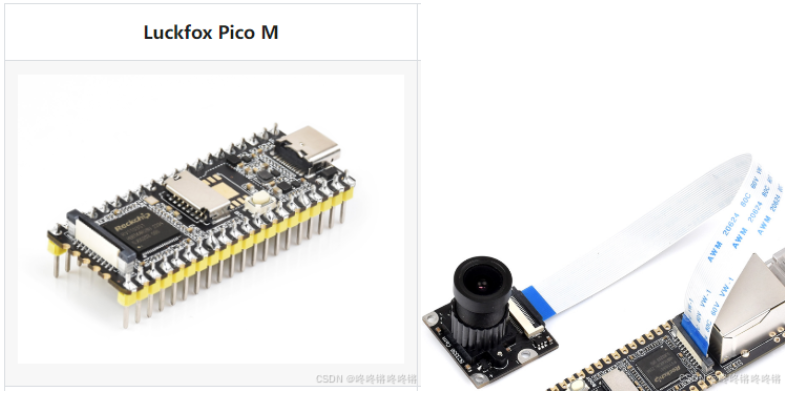

硬件：`luckfox_pico_RV1103`，摄像头是`SC3336 3MP Camera (A)`摄像头，参考[RV1103 Luckfox Pico使用SPI NAND Flash烧录镜像](https://blog.csdn.net/weixin_45977690/article/details/140384421?spm=1001.2014.3001.5501)焊了`nand flash`，烧录的`buildroot`系统。



在官方的[luckfox_pico_rtsp_retinaface](https://github.com/luckfox-eng29/luckfox_pico_rtsp_retinaface)的基础上，参考[luckfox_pico_rknn_example](https://github.com/luckfox-eng29/luckfox_pico_rknn_example/tree/master)增加`facenet`实现人脸识别功能。

### 编译

前提需要下载`luckfox pico`的sdk：https://github.com/LuckfoxTECH/luckfox-pico或者https://gitee.com/LuckfoxTECH/luckfox-pico，编译脚本：

```bash
export LUCKFOX_SDK_PATH=< 你的 Luckfox-pico SDK 路径>
mkdir build
cd build
cmake ..
make && make install
# 在确定能adb连接开发板后将程序push进开发板
adb push ../luckfox_retinaface_facenet_demo/ /
```

### 运行程序

准备一张人脸局部图片`test.jpg`，图片也`push`进开发板：`adb push test.jpg /luckfox_retinaface_facenet_demo`

`adb shell`连接开发板

`top`或者`ps`输出自启动的程序有哪些，需要`kill`掉一些程序释放出内存才能跑起来

```bash
[root@luckfox ]# top
Mem: 26820K used, 920K free, 228K shrd, 0K buff, 1604K cached
CPU:  17% usr  79% sys   0% nic   2% idle   0% io   0% irq   0% sirq
Load average: 11.21 3.00 1.02 2/106 426
  PID  PPID USER     STAT   VSZ %VSZ %CPU COMMAND
  251     1 root     S    92616 334%  51% rkipc -a /oem/usr/share/iqfiles
  401   399 root     D    31148 112%   8% smbd -D
  425   420 root     R     1796   6%   8% top
   36     2 root     SW       0   0%   8% [kswapd0]
  424   423 root     S     1800   6%   5% {default.script} /bin/sh /usr/share/ud
  190     2 root     SW       0   0%   5% [vcodec_thread_0]
  193     1 root     S     5368  19%   3% /usr/sbin/ntpd -g -p /var/run/ntpd.pid
  355     1 root     S    14392  52%   0% /usr/bin/adbd
  314     1 root     S     4852  17%   0% sshd: /usr/sbin/sshd [listener] 0 of 1
  420   355 root     S     1804   6%   0% /bin/sh -l
   65     1 root     S     1800   6%   0% {rcS} /bin/sh /etc/init.d/rcS
    1     0 root     S     1796   6%   0% init
  423   251 root     S     1792   6%   0% udhcpc -i usb0 -T 1 -A 0 -b -q
  399    65 root     S     1792   6%   0% {S91smb} /bin/sh /etc/init.d/S91smb st
   71     1 root     S     1788   6%   0% /sbin/syslogd -n
  320     1 root     S     1788   6%   0% /usr/sbin/telnetd -F
   75     1 root     S     1784   6%   0% /sbin/klogd -n
   86     1 root     S     1628   6%   0% /sbin/udevd -d
  426   424 root     D     1012   4%   0% /sbin/ifconfig usb0 up
   41     2 root     IW       0   0%   0% [kworker/u2:1-fl]
[root@luckfox ]# killall rkipc
[root@luckfox ]# killall smbd
[root@luckfox ]# killall sshd
[root@luckfox ]# killall ntpd
[root@luckfox ]# killall udhcpc
[root@luckfox ]# killall nmbd
```

运行程序，将摄像头对着人后会输入人脸在摄像头中的坐标位置，`norm`表示的是摄像头中的人与`test.jpg`的参考人的特征向量的距离，数值越小两人越相似。

```bash
[root@luckfox luckfox_retinaface_facenet_demo]# ./luckfox_rtsp_retinaface 
this device is not whitelisted for jpeg decoder cvi
this device is not whitelisted for jpeg decoder cvi
this device is not whitelisted for jpeg decoder cvi
init retinaface
init facenet
Retinaface Info
model input num: 1, output num: 3
input tensors:
  index=0, name=input.1, n_dims=4, dims=[1, 640, 640, 3], n_elems=1228800, size=1228800, fmt=NHWC, type=INT8, qnt_type=AFFINE, zp=-128, scale=1.000000
output tensors:
  index=0, name=515, n_dims=3, dims=[1, 16800, 4, 0], n_elems=67200, size=67200, fmt=UNDEFINED, type=INT8, qnt_type=AFFINE, zp=-125, scale=1.951411
  index=1, name=553, n_dims=3, dims=[1, 16800, 2, 0], n_elems=33600, size=33600, fmt=UNDEFINED, type=INT8, qnt_type=AFFINE, zp=-2, scale=0.243586
  index=2, name=592, n_dims=3, dims=[1, 16800, 10, 0], n_elems=168000, size=168000, fmt=UNDEFINED, type=INT8, qnt_type=AFFINE, zp=-119, scale=1.485194
input_attrs[0].size_with_stride=1228800
output mem [0] = 67200 
output mem [1] = 33600 
output mem [2] = 168000 
model is NHWC input fmt
Facenet Info
model input num: 1, output num: 1
input tensors:
  index=0, name=input.1, n_dims=4, dims=[1, 160, 160, 3], n_elems=76800, size=76800, fmt=NHWC, type=INT8, qnt_type=AFFINE, zp=-128, scale=0.003922
output tensors:
  index=0, name=313, n_dims=2, dims=[1, 128, 0, 0], n_elems=128, size=128, fmt=UNDEFINED, type=INT8, qnt_type=AFFINE, zp=9, scale=0.081335
input_attrs[0].size_with_stride=76800
output mem [0] = 128 
Init success 
init rknn model success!
rkaiq log level ff0
ID: 0, sensor_name is m00_b_sc3336 4-0030, iqfiles is /etc/iqfiles
rk_aiq_uapi2_sysctl_init/prepare succeed
rk_aiq_uapi2_sysctl_start succeed
rockit log path (null), log_size = 0, can use export rt_log_path=, export rt_log_size= change
log_file = (nil) 
RTVersion        00:46:07-118 {dump              :064} ---------------------------------------------------------
RTVersion        00:46:07-268 {dump              :065} rockit version: git-8cb4d25b8 Tue Feb 28 11:12:39 2023 +0800
RTVersion        00:46:07-268 {dump              :066} rockit building: built- 2023-02-28 15:23:19
RTVersion        00:46:07-268 {dump              :067} ---------------------------------------------------------
(null)           00:46:07-268 {log_level_init    :203} 

 please use echo name=level > /tmp/rt_log_level set log level 
        name: all cmpi mb sys vdec venc rgn vpss vgs tde avs wbc vo vi ai ao aenc adec
        log_level: 0 1 2 3 4 5 6 

rockit default level 4, can use export rt_log_level=x, x=0,1,2,3,4,5,6 change
(null)           00:46:07-268 {read_log_level    :093} text is all=4
(null)           00:46:07-275 {read_log_level    :095} module is all, log_level is 4
(null)           00:46:07-297 {monitor_log_level :144} #Start monitor_log_level thread, arg:(nil)
RTIsp3x          00:46:07-398 {ispInitDevice     :208} sensor name = m00_b_sc3336 4-0030
RTIsp3x          00:46:07-399 {ispInitDevice     :211} sensor_index = 0
RTIsp3x          00:46:07-408 {ispInitDevice     :208} sensor name = m00_b_sc3336 4-0030
RTIsp3x          00:46:07-409 {ispInitDevice     :211} sensor_index = 0
vi_dev_init
RKViDev          00:46:07-442 {vi_set_dev_attr   :440} VI_DEV_ATTR_S all parameter reserved
  === VI ATTRS INFO: ===  
        devId  :      0
        chnId  :      0
        buffcnt:      0
        buffSize:     0
        width:        0
        height:       0
        Maxwidth:     0
        Maxwidth:     0
        streaming:    0
RKViChn          00:46:07-453 {prepareRuntime    :334} ---------------------------------------------------------
RKViChn          00:46:07-453 {prepareRuntime    :336} vi version: 1.86, name:vvi
RKViChn          00:46:07-453 {prepareRuntime    :337} rockit-ko version: vmpi:fb2eed2be49e
RKViChn          00:46:07-453 {prepareRuntime    :338} rockit-ko building: -2023-02-09-11:04:49
RKViChn          00:46:07-453 {prepareRuntime    :339} ---------------------------------------------------------
RKViChn          00:46:07-466 {prepareRuntime    :358} mb pool create success, MBCnt= 2
cmpi             00:46:07-468 {createRuntime     :546} [non-WRAP MODE]: buff size = 518400
RTIsp3x          00:46:07-478 {ispInitDevice     :208} sensor name = m00_b_sc3336 4-0030
RTIsp3x          00:46:07-479 {ispInitDevice     :211} sensor_index = 0
RTDeviceV4L2     00:46:07-486 {open              :138} open video name(/dev/video11)
RKViChn          00:46:07-487 {setFrameRate      :1153} [vi] dev(0) ch(0) illegal param s32SrcFrameRate(0) s32DstFrameRate(0)
RTDeviceV4L2     00:46:07-489 {ispCameraInfo     :549} current device:/dev/video11 isn't compatible(cap:0x84201000) device,memoryType:4, retry:0
RTDeviceV4L2     00:46:07-494 {ispInitFormat     :726} ioctl VIDIOC_S_FMT OK
RKViChn          00:46:07-494 {start             :813} =========== vi Start startRuntime ===========
RTDeviceV4L2     00:46:07-494 {ispStreamOn       :440} do ispStreamOn start
RTDeviceV4L2     00:46:07-515 {ispStreamOn       :493} do ispStreamOn done
test_vpss_init
=== 0 ===
=== 1 ===
rga_api version 1.10.0_[2]
====RK_MPI_SYS_Bind vi0 to vpss0====
Loop
cmpi             00:46:07-638 {mb_get_buffer_by_i:422} allocated buffer(this=0x3b5eb8, data=(nil), size=0, id=-1)
fps = 0.0
fps = 12.5
466 456 509 520
norm = 1.40
fps = 16.7
fps = 12.5
216 192 344 381
norm = 1.21
fps = 14.3
```

